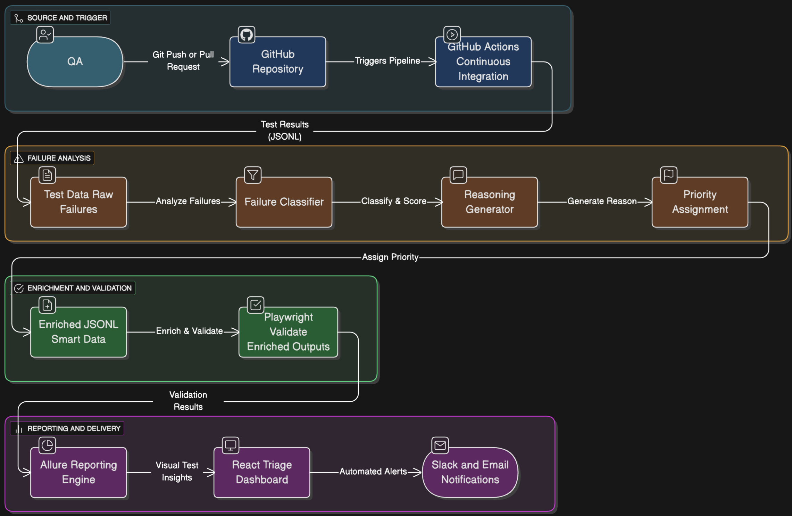

🧠 Next-Gen QA Hackathon – Smart QA Intelligence Platform

Welcome to the Next-Gen QA Intelligence Platform, an automated system that:

🚀 Executes Playwright automation tests
🧬 Enriches test results into intelligent insights
📊 Visualizes trends in a React-powered Triage Dashboard
🔔 Sends Slack & Email notifications
☁️ Auto-deploys via GitHub Pages

🧩 Architecture Diagram

You can add a visual architecture diagram here for clarity.

⚙️ For E2E Demo Purpose

Install all dependencies (Step 1–3) and run the below command from project root:
npm run full:demo

✅ 1️⃣ Prerequisites

Ensure you have these installed:

Node.js 18+
npm
Git
(Optional but recommended): VS Code + Playwright Test Extension

📥 2️⃣ Clone the Repository
git clone https://github.com/gunashekarryml/next-gen-qa-hackathon.git
cd next-gen-qa-hackathon

📦 3️⃣ Install Dependencies

For Dashboard

cd triage-dashboard
npm install

For Playwright Tests

cd ../playwright-tests
npm install
npx playwright install

🧪 4️⃣ Run Automation Tests Locally
cd playwright-tests
npm test

📁 Results saved in:
/playwright-tests/results/

🧬 5️⃣ Generate Enriched Data (Used by Dashboard)

The pipeline converts test results to JSONL format.
To simulate locally:

npm run enrich

📁 Output:
triage-dashboard/src/data/TestData.enriched.jsonl

🎯 6️⃣ Start the Dashboard (Local Preview)
cd ../triage-dashboard
npm start

Open in your browser:
👉 http://localhost:3000/

📊 Dashboards You’ll See

✅ CI/CD Success Over Time
✅ Failure Heatmaps & Clustering
✅ Smart QA Root Cause Visuals
✅ Category-based Grouping

🛰️ CI/CD Pipeline Overview
Stage	Actions
✅ Build Dashboard	npm install + npm run build
✅ Run Tests	Playwright execution
✅ Generate Data	Enrich JSONL output
✅ Deploy Dashboard	GitHub Pages
✅ Notifications	Slack + Email

Your dashboard stays live & auto-updated with the latest results.

📁 Folder Structure
next-gen-qa-hackathon/
 ├─ triage-dashboard/        # React UI
 │   ├─ src/components/      # Charts, Tables, AI visuals
 │   ├─ src/data/            # Enriched test history inputs
 │   └─ build/               # Production assets
 ├─ playwright-tests/        # E2E automation suite
 │   └─ results/             # Test outputs
 └─ .github/workflows/       # CI pipeline

🔌 Integrations
Service	Purpose
GitHub Pages	Dashboard hosting
Slack	Run status alerts
Email	Test summary notifications

🚀 Tech Stack

🧪 Playwright – Web and API automation with cross-browser coverage
⚡ TypeScript – Strongly-typed, scalable test scripting language
🔄 GitHub Actions – Automated CI/CD pipelines and scheduled builds
🧱 React + TypeScript – Interactive triage and analytics dashboard
📊 Recharts – Donut charts, trend analytics, and failure insights
🎞️ Framer Motion + Tailwind CSS – Modern UI animations and styling
🧾 Allure Report – Detailed test reports with screenshots and logs
📢 Slack + Email Integrations – Instant triage alerts and summaries
🤖 QA Copilot (Custom) – AI-driven root cause prediction and reasoning
🌿 GitHub + GitHub Pages – Version control and live dashboard hosting

🤝 Contribution Guide

1️⃣ Create a feature branch
2️⃣ Add or update tests
3️⃣ Submit a PR with screenshots & results

Branch naming rule:
feature/<ticket-id>-

🏆 Hackathon Value Proposition

🎯 Faster triage
📈 Continuous visibility
🤖 AI-powered insights
⏱ Reduced QA friction

Bring metrics to life. Empower QA with intelligence.

👥 Contributors

Guna
Mounika
Naimisha
Nidhi
Nirupama

✍️ Author

Created with passion by Team Next-Gen-QA

💡 “Quality-driven minds building intelligent QA systems.”

